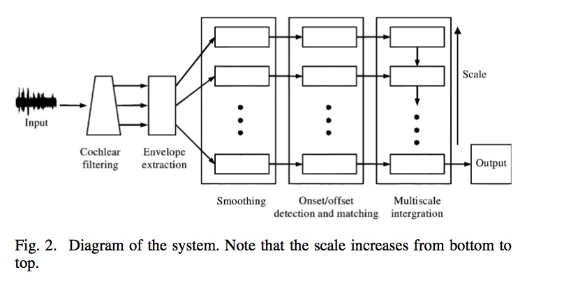
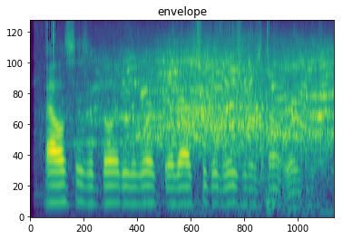
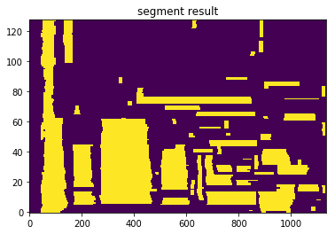

# Auditory_Segmentation
Auditory event segregation based on onset and offset detection. 
Framework

reference 
HU G, WANG D. Auditory Segmentation Based on Onset and Offset Analysis[J]. Ieee Transactions on Audio Speech and Language
Processing, 2007, 15(2): 396–405.

C code written by Hu G. can be found [here]((http://web.cse.ohio-state.edu/~wang.77/pnl/shareware/hu-taslp07/))

 Example
 - Envelope(128 frequency channels)
 

- Segmentation result (can be further optimized)

